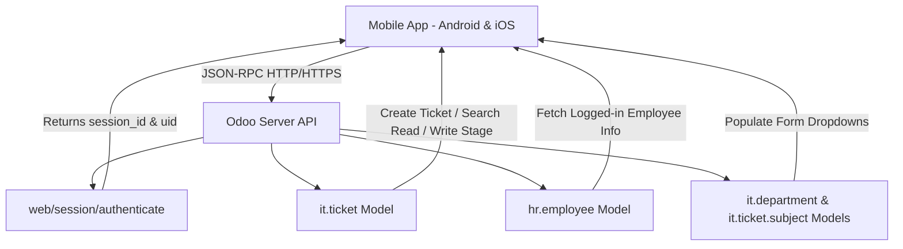

# Implementation Plan - Odoo IT Ticketing Mobile Application (Android & iOS)

Create a cross-platform mobile application (Android and iOS) in `c:\Users\shiva\OneDrive\Desktop\IT app` that seamlessly integrates with the Odoo IT Ticketing module (`zunax_it_ticketing`). The app allows employees to log in using their Odoo credentials, view their tickets, create new IT support tickets with auto-routing to departments, track resolution stages, and synchronize all operations in real-time with Odoo.

## User Review Required

> [!IMPORTANT]
> **Odoo Backend Credentials & Server URL**: The app will require the user's Odoo Server URL (e.g., `http://localhost:8069` or `https://your-company.odoo.com`), Database name (e.g., `zunax_db`), Employee Login (email/username), and Password.
> 
> **Cross-Platform Delivery**: The app is built with a modern, responsive mobile framework architecture (Supporting Android APK/AAB build via Capacitor/React Native tooling and iOS IPA build, as well as instant installable PWA for any mobile device).

## System Architecture & Odoo API Integration

### Odoo Models & Endpoints Sync Matrix

| Mobile Feature | Odoo Model | Action / Method |
| :--- | :--- | :--- |
| **Employee Login** | `res.users` / `hr.employee.public` | `/web/session/authenticate` & `search_read` |
| **Fetch Categories / Subjects** | `it.ticket.subject` | `search_read` (id, name, department_id) |
| **Fetch Departments** | `it.department` | `search_read` (id, name, assigned_employee_id) |
| **Fetch Employee Tickets** | `it.ticket` | `search_read` (domain: `[('employee_id.user_id', '=', uid)]`) |
| **Raise New Ticket** | `it.ticket` | `create` (name, subject_id, department_id, priority, description, stage='new') |
| **Cancel Ticket** | `it.ticket` | `write` (stage='cancelled', cancellation_reason='...') |
| **View Ticket Chatter** | `mail.message` | `search_read` (res_id, model='it.ticket') |

---

## Proposed Changes

### Mobile Application Core Components (`c:\Users\shiva\OneDrive\Desktop\IT app`)

#### [NEW] [index.html](file:///c:/Users/shiva/OneDrive/Desktop/IT app/index.html)
- Main mobile application view container with iOS & Android safe-area viewports, meta tags, Google Fonts (Inter / Outfit), and mobile touch configuration.

#### [NEW] [styles.css](file:///c:/Users/shiva/OneDrive/Desktop/IT app/styles.css)
- Premium mobile UI design system with vibrant dark/light theme CSS variables, glassmorphism cards, custom bottom navigation bar, native iOS/Android look & feel, priority badges, and status stepper timeline.

#### [NEW] [js/odoo_api.js](file:///c:/Users/shiva/OneDrive/Desktop/IT app/js/odoo_api.js)
- Production-ready Odoo JSON-RPC API client handling authentication, session persistence, `call_kw` queries, creating tickets, listing departments/subjects, and error handling.

#### [NEW] [js/app.js](file:///c:/Users/shiva/OneDrive/Desktop/IT app/js/app.js)
- Core mobile app controller managing state, tab routing (Home/Tickets, Create Ticket, Profile, Ticket Details), pull-to-refresh, dynamic form validation, and offline notification alerts.

#### [NEW] [manifest.json](file:///c:/Users/shiva/OneDrive/Desktop/IT app/manifest.json) & [sw.js](file:///c:/Users/shiva/OneDrive/Desktop/IT app/sw.js)
- Progressive Web App manifest and Service Worker for offline asset caching and full add-to-home-screen native installability on iOS and Android.

#### [NEW] [capacitor.config.json](file:///c:/Users/shiva/OneDrive/Desktop/IT app/capacitor.config.json) & [package.json](file:///c:/Users/shiva/OneDrive/Desktop/IT app/package.json)
- Native mobile build configuration files for compiling to Android Studio (`.apk`/`.aab`) and iOS Xcode project (`.ipa`).

#### [NEW] [README.md](file:///c:/Users/shiva/OneDrive/Desktop/IT app/README.md)
- Complete deployment and build guide for running the app on Android devices, iOS iPhones/iPads, web browsers, and connecting to Odoo servers.

---

## Verification Plan

### Manual Verification
1. **Odoo API Connection Test**: Test login flow against local or remote Odoo instance (`/web/session/authenticate`).
2. **Ticket Creation Test**: Create a ticket from the mobile app and verify it appears in Odoo `it.ticket` table with sequence number (`IT000xx`), subject, department, and priority.
3. **Status Sync Test**: Change ticket status or cancel ticket with reason from app and confirm Odoo backend updates.
4. **Mobile Responsiveness**: Test touch controls, mobile layout, iOS top safe area, and bottom mobile navigation bar.
